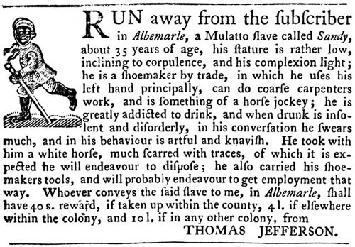

## 
 Escaping Slavery: A Quantitative Study of Age, Gender, and
 Regional Trends from the Freedom on the Move Database[¶](#Escaping-Slavery:-A-Quantitative-Study-of-Age,-Gender,-and-Regional-Trends-from-the-Freedom-on-the-Move-Database)


***Jiawen Huang***


**Research Project (CU Denver spring 2025)**


> 
> 
> *Note: Generative AI was used to help generate some of the
>  code in this project.*
> 
> 
> 
> 




 The Freedom on the Move
 


[View the original dataset](https://database.freedomonthemove.org/)


### 
 Introduction[¶](#Introduction)


 In the first half of the 19th century, the slavery system in the
 United States continued to develop with the expansion of its
 territory, and the contradiction between the North and the South
 regarding slavery also intensified increasingly. Against this
 historical backdrop, a large number of enslaved African
 Americans chose to seek freedom by runaway (becoming "fugitive
 slaves"), but the scale and characteristics of these escape
 events lack detailed personal records, and it has been difficult
 to conduct quantitative research on the demographic
 characteristics of the fugitive slave group in history. The
 Freedom on the Move (FOTM) project led by Cornell University has
 created a comprehensive database of fugitive slave
 advertisements in North America, gathering tens of thousands of
 fugitive slave notices from American newspapers and periodicals
 in the 19th century. These advertisements were usually published
 by slave owners, detailing the personal information of the
 escapees such as their names, genders, ages, and physical
 features. FOTM data provides valuable information for studying
 the struggles of the enslaved during the slavery period,
 enabling us to systematically examine the scale and patterns of
 the phenomenon of runaway slavery from a data perspective. Some
 existing studies have also explored similar directions. For
 example, Shaun Wallace (2017), by analyzing over 5,000
 advertisements for runaway slaves in Georgia and Maryland
 between 1790 and 1810, revealed the connection between the
 gender, age, literacy ability and rebellious behavior of runaway
 slaves, emphasizing that these advertisement texts not only
 recorded the runaway events, It also retains the details and
 subjectivity of the struggles of the enslaved. Other studies
 have focused more on the analysis of the advertisement itself,
 while this study focuses on extensive statistics. Based on the
 text data of the FOTM database, it analyzes the basic
 demographic patterns and changes of the fugitive slaves in the
 United States in the 19th century. In other words, we attempt to
 answer the following several specific questions through data:
 


1. 
 Gender composition: What are the proportions of men and women
 in the group of runaway slaves?
2. 
 Age distribution: What is the age distribution of the runaway
 slaves? Are there any significant differences in the age
 structure between male and female runaway slaves?
3. 
 Geographical distribution: Which states or regions did these
 runaway slaves mainly flee from? Is there a regional
 concentration phenomenon?
4. 
 Gender Influence of Slave Owners: Are there differences in the
 frequency of slave escapes experienced by slave owners of
 different genders and the gender composition of escapees?
5. 
 Time Trend: How does the number of runaway slaves recorded
 each year change? Do these annual changes coincide with the
 major historical events during the expansion of slavery and
 the intensification of the conflict between the North and the
 South?


 Through the statistical and visual analysis of these variables,
 this project attempts to answer the following core question:
 Against the historical background of the expansion of slavery
 and the intensification of North-South contradictions, what
 structural characteristics do the gender, age and geographical
 distribution of the group of runaway slaves present? How did
 these characteristics interact with the gender of the slave
 owners, institutional pressure and historical events?
 


In [52]:


```
import pandas as pd
import plotly.io as pio
import plotly.offline as pyo
pio.renderers.default = "jupyterlab"
pyo.init\_notebook\_mode(connected=True)

file\_path = 'C:/Users/GAVIN/Desktop/research-project/data/original/FOTM-Dataset-Full-Flattened.csv' 
df\_1 = pd.read\_csv(file\_path, low\_memory=False)
pd.set\_option('display.max\_columns', None)  
pd.set\_option('display.expand\_frame\_repr', False)  

df\_1.head() 

```


Out[52]:


 .dataframe tbody tr th:only-of-type {
 vertical-align: middle;
 }

 .dataframe tbody tr th {
 vertical-align: top;
 }

 .dataframe thead th {
 text-align: right;
 }
 


|  | runaway\_id | enslaved\_person\_id | enslaved\_person\_name\_id 1 | enslaved\_person\_name\_fullname 1 | enslaved\_person\_name\_is\_alias 1 | enslaved\_person\_name\_id 2 | enslaved\_person\_name\_fullname 2 | enslaved\_person\_name\_is\_alias 2 | enslaved\_person\_name\_id 3 | enslaved\_person\_name\_fullname 3 | enslaved\_person\_name\_is\_alias 3 | enslaved\_person\_name\_id 4 | enslaved\_person\_name\_fullname 4 | enslaved\_person\_name\_is\_alias 4 | enslaved\_person\_name\_id 5 | enslaved\_person\_name\_fullname 5 | enslaved\_person\_name\_is\_alias 5 | enslaved\_person\_name\_id 6 | enslaved\_person\_name\_fullname 6 | enslaved\_person\_name\_is\_alias 6 | enslaved\_person\_name\_id 7 | enslaved\_person\_name\_fullname 7 | enslaved\_person\_name\_is\_alias 7 | enslaved\_person\_name\_id 8 | enslaved\_person\_name\_fullname 8 | enslaved\_person\_name\_is\_alias 8 | enslaved\_person\_name\_id 9 | enslaved\_person\_name\_fullname 9 | enslaved\_person\_name\_is\_alias 9 | enslaved\_person\_name\_id 10 | enslaved\_person\_name\_fullname 10 | enslaved\_person\_name\_is\_alias 10 | enslaved\_person\_name\_id 11 | enslaved\_person\_name\_fullname 11 | enslaved\_person\_name\_is\_alias 11 | enslaved\_person\_name\_id 12 | enslaved\_person\_name\_fullname 12 | enslaved\_person\_name\_is\_alias 12 | enslaved\_person\_name\_id 13 | enslaved\_person\_name\_fullname 13 | enslaved\_person\_name\_is\_alias 13 | enslaved\_person\_name\_id 14 | enslaved\_person\_name\_fullname 14 | enslaved\_person\_name\_is\_alias 14 | enslaved\_person\_name\_id 15 | enslaved\_person\_name\_fullname 15 | enslaved\_person\_name\_is\_alias 15 | enslaved\_person\_name\_id 16 | enslaved\_person\_name\_fullname 16 | enslaved\_person\_name\_is\_alias 16 | enslaved\_person\_name\_id 17 | enslaved\_person\_name\_fullname 17 | enslaved\_person\_name\_is\_alias 17 | enslaved\_person\_name\_id 18 | enslaved\_person\_name\_fullname 18 | enslaved\_person\_name\_is\_alias 18 | enslaved\_person\_name\_id 19 | enslaved\_person\_name\_fullname 19 | enslaved\_person\_name\_is\_alias 19 | enslaved\_person\_name\_id 20 | enslaved\_person\_name\_fullname 20 | enslaved\_person\_name\_is\_alias 20 | enslaved\_person\_name\_id 21 | enslaved\_person\_name\_fullname 21 | enslaved\_person\_name\_is\_alias 21 | enslaved\_person\_name\_id 22 | enslaved\_person\_name\_fullname 22 | enslaved\_person\_name\_is\_alias 22 | enslaved\_person\_name\_id 23 | enslaved\_person\_name\_fullname 23 | enslaved\_person\_name\_is\_alias 23 | enslaved\_person\_name\_id 24 | enslaved\_person\_name\_fullname 24 | enslaved\_person\_name\_is\_alias 24 | enslaved\_person\_name\_id 25 | enslaved\_person\_name\_fullname 25 | enslaved\_person\_name\_is\_alias 25 | enslaved\_person\_name\_id 26 | enslaved\_person\_name\_fullname 26 | enslaved\_person\_name\_is\_alias 26 | gender | literacy | skills | ran\_before | profess\_freedom | racial\_description | ethnic\_description | approximate\_age | min\_age | max\_age | approximate\_height | min\_height | max\_height | approximate\_weight | min\_weight | max\_weight | injuries\_scars | self\_presentation | other\_physical\_descriptions | possessions | runaway\_event\_id | escapee\_count | runaway\_event\_min\_occurred | runaway\_event\_max\_occurred | outside\_involvement | advertisement\_id | advertisement\_transcription | advertisement\_language | publication\_date | page\_number | newspaper\_id | newspaper\_name | newspaper\_location\_name | newspaper\_location\_city | newspaper\_location\_county | newspaper\_location\_state | newspaper\_location\_country | advertiser\_id | advertiser\_type | advertiser\_name | advertiser\_location\_name | advertiser\_location\_city | advertiser\_location\_county | advertiser\_location\_state | advertiser\_location\_country | enslaved\_person\_language\_id 1 | enslaved\_person\_language\_name 1 | enslaved\_person\_language\_does\_speak 1 | enslaved\_person\_language\_id 2 | enslaved\_person\_language\_name 2 | enslaved\_person\_language\_does\_speak 2 | enslaved\_person\_language\_id 3 | enslaved\_person\_language\_name 3 | enslaved\_person\_language\_does\_speak 3 | enslaved\_person\_language\_id 4 | enslaved\_person\_language\_name 4 | enslaved\_person\_language\_does\_speak 4 | enslaved\_person\_language\_id 5 | enslaved\_person\_language\_name 5 | enslaved\_person\_language\_does\_speak 5 | enslaved\_person\_language\_id 6 | enslaved\_person\_language\_name 6 | enslaved\_person\_language\_does\_speak 6 | runaway\_location\_location\_id 1 | runaway\_location\_name 1 | runaway\_location\_city 1 | runaway\_location\_county 1 | runaway\_location\_state 1 | runaway\_location\_country 1 | runaway\_location\_type 1 | runaway\_location\_reason 1 | runaway\_location\_location\_id 2 | runaway\_location\_name 2 | runaway\_location\_city 2 | runaway\_location\_county 2 | runaway\_location\_state 2 | runaway\_location\_country 2 | runaway\_location\_type 2 | runaway\_location\_reason 2 | runaway\_location\_location\_id 3 | runaway\_location\_name 3 | runaway\_location\_city 3 | runaway\_location\_county 3 | runaway\_location\_state 3 | runaway\_location\_country 3 | runaway\_location\_type 3 | runaway\_location\_reason 3 | runaway\_location\_location\_id 4 | runaway\_location\_name 4 | runaway\_location\_city 4 | runaway\_location\_county 4 | runaway\_location\_state 4 | runaway\_location\_country 4 | runaway\_location\_type 4 | runaway\_location\_reason 4 | runaway\_location\_location\_id 5 | runaway\_location\_name 5 | runaway\_location\_city 5 | runaway\_location\_county 5 | runaway\_location\_state 5 | runaway\_location\_country 5 | runaway\_location\_type 5 | runaway\_location\_reason 5 | runaway\_location\_location\_id 6 | runaway\_location\_name 6 | runaway\_location\_city 6 | runaway\_location\_county 6 | runaway\_location\_state 6 | runaway\_location\_country 6 | runaway\_location\_type 6 | runaway\_location\_reason 6 | runaway\_location\_location\_id 7 | runaway\_location\_name 7 | runaway\_location\_city 7 | runaway\_location\_county 7 | runaway\_location\_state 7 | runaway\_location\_country 7 | runaway\_location\_type 7 | runaway\_location\_reason 7 | runaway\_location\_location\_id 8 | runaway\_location\_name 8 | runaway\_location\_city 8 | runaway\_location\_county 8 | runaway\_location\_state 8 | runaway\_location\_country 8 | runaway\_location\_type 8 | runaway\_location\_reason 8 | runaway\_location\_location\_id 9 | runaway\_location\_name 9 | runaway\_location\_city 9 | runaway\_location\_county 9 | runaway\_location\_state 9 | runaway\_location\_country 9 | runaway\_location\_type 9 | runaway\_location\_reason 9 | runaway\_location\_location\_id 10 | runaway\_location\_name 10 | runaway\_location\_city 10 | runaway\_location\_county 10 | runaway\_location\_state 10 | runaway\_location\_country 10 | runaway\_location\_type 10 | runaway\_location\_reason 10 | runaway\_location\_location\_id 11 | runaway\_location\_name 11 | runaway\_location\_city 11 | runaway\_location\_county 11 | runaway\_location\_state 11 | runaway\_location\_country 11 | runaway\_location\_type 11 | runaway\_location\_reason 11 | runaway\_location\_location\_id 12 | runaway\_location\_name 12 | runaway\_location\_city 12 | runaway\_location\_county 12 | runaway\_location\_state 12 | runaway\_location\_country 12 | runaway\_location\_type 12 | runaway\_location\_reason 12 | runaway\_location\_location\_id 13 | runaway\_location\_name 13 | runaway\_location\_city 13 | runaway\_location\_county 13 | runaway\_location\_state 13 | runaway\_location\_country 13 | runaway\_location\_type 13 | runaway\_location\_reason 13 | runaway\_location\_location\_id 14 | runaway\_location\_name 14 | runaway\_location\_city 14 | runaway\_location\_county 14 | runaway\_location\_state 14 | runaway\_location\_country 14 | runaway\_location\_type 14 | runaway\_location\_reason 14 | runaway\_reward\_id 1 | runaway\_reward\_amount 1 | runaway\_reward\_currency 1 | runaway\_reward\_criteria 1 | runaway\_reward\_id 2 | runaway\_reward\_amount 2 | runaway\_reward\_currency 2 | runaway\_reward\_criteria 2 | runaway\_reward\_id 3 | runaway\_reward\_amount 3 | runaway\_reward\_currency 3 | runaway\_reward\_criteria 3 | runaway\_reward\_id 4 | runaway\_reward\_amount 4 | runaway\_reward\_currency 4 | runaway\_reward\_criteria 4 | runaway\_reward\_id 5 | runaway\_reward\_amount 5 | runaway\_reward\_currency 5 | runaway\_reward\_criteria 5 | runaway\_reward\_id 6 | runaway\_reward\_amount 6 | runaway\_reward\_currency 6 | runaway\_reward\_criteria 6 | runaway\_reward\_id 7 | runaway\_reward\_amount 7 | runaway\_reward\_currency 7 | runaway\_reward\_criteria 7 | runaway\_reward\_id 8 | runaway\_reward\_amount 8 | runaway\_reward\_currency 8 | runaway\_reward\_criteria 8 | enslaver\_id 1 | enslaver\_fullname 1 | enslaver\_type 1 | enslaver\_gender 1 | enslaver\_location\_id 1 | enslaver\_location\_name 1 | enslaver\_location\_city 1 | enslaver\_location\_county 1 | enslaver\_location\_state 1 | enslaver\_location\_country 1 | enslaver\_id 2 | enslaver\_fullname 2 | enslaver\_type 2 | enslaver\_gender 2 | enslaver\_location\_id 2 | enslaver\_location\_name 2 | enslaver\_location\_city 2 | enslaver\_location\_county 2 | enslaver\_location\_state 2 | enslaver\_location\_country 2 | enslaver\_id 3 | enslaver\_fullname 3 | enslaver\_type 3 | enslaver\_gender 3 | enslaver\_location\_id 3 | enslaver\_location\_name 3 | enslaver\_location\_city 3 | enslaver\_location\_county 3 | enslaver\_location\_state 3 | enslaver\_location\_country 3 | enslaver\_id 4 | enslaver\_fullname 4 | enslaver\_type 4 | enslaver\_gender 4 | enslaver\_location\_id 4 | enslaver\_location\_name 4 | enslaver\_location\_city 4 | enslaver\_location\_county 4 | enslaver\_location\_state 4 | enslaver\_location\_country 4 | enslaver\_id 5 | enslaver\_fullname 5 | enslaver\_type 5 | enslaver\_gender 5 | enslaver\_location\_id 5 | enslaver\_location\_name 5 | enslaver\_location\_city 5 | enslaver\_location\_county 5 | enslaver\_location\_state 5 | enslaver\_location\_country 5 | enslaver\_id 6 | enslaver\_fullname 6 | enslaver\_type 6 | enslaver\_gender 6 | enslaver\_location\_id 6 | enslaver\_location\_name 6 | enslaver\_location\_city 6 | enslaver\_location\_county 6 | enslaver\_location\_state 6 | enslaver\_location\_country 6 | enslaver\_id 7 | enslaver\_fullname 7 | enslaver\_type 7 | enslaver\_gender 7 | enslaver\_location\_id 7 | enslaver\_location\_name 7 | enslaver\_location\_city 7 | enslaver\_location\_county 7 | enslaver\_location\_state 7 | enslaver\_location\_country 7 | enslaver\_id 8 | enslaver\_fullname 8 | enslaver\_type 8 | enslaver\_gender 8 | enslaver\_location\_id 8 | enslaver\_location\_name 8 | enslaver\_location\_city 8 | enslaver\_location\_county 8 | enslaver\_location\_state 8 | enslaver\_location\_country 8 | enslaver\_id 9 | enslaver\_fullname 9 | enslaver\_type 9 | enslaver\_gender 9 | enslaver\_location\_id 9 | enslaver\_location\_name 9 | enslaver\_location\_city 9 | enslaver\_location\_county 9 | enslaver\_location\_state 9 | enslaver\_location\_country 9 | enslaver\_id 10 | enslaver\_fullname 10 | enslaver\_type 10 | enslaver\_gender 10 | enslaver\_location\_id 10 | enslaver\_location\_name 10 | enslaver\_location\_city 10 | enslaver\_location\_county 10 | enslaver\_location\_state 10 | enslaver\_location\_country 10 | enslaver\_id 11 | enslaver\_fullname 11 | enslaver\_type 11 | enslaver\_gender 11 | enslaver\_location\_id 11 | enslaver\_location\_name 11 | enslaver\_location\_city 11 | enslaver\_location\_county 11 | enslaver\_location\_state 11 | enslaver\_location\_country 11 | enslaver\_id 12 | enslaver\_fullname 12 | enslaver\_type 12 | enslaver\_gender 12 | enslaver\_location\_id 12 | enslaver\_location\_name 12 | enslaver\_location\_city 12 | enslaver\_location\_county 12 | enslaver\_location\_state 12 | enslaver\_location\_country 12 | enslaver\_id 13 | enslaver\_fullname 13 | enslaver\_type 13 | enslaver\_gender 13 | enslaver\_location\_id 13 | enslaver\_location\_name 13 | enslaver\_location\_city 13 | enslaver\_location\_county 13 | enslaver\_location\_state 13 | enslaver\_location\_country 13 | enslaver\_id 14 | enslaver\_fullname 14 | enslaver\_type 14 | enslaver\_gender 14 | enslaver\_location\_id 14 | enslaver\_location\_name 14 | enslaver\_location\_city 14 | enslaver\_location\_county 14 | enslaver\_location\_state 14 | enslaver\_location\_country 14 | enslaver\_id 15 | enslaver\_fullname 15 | enslaver\_type 15 | enslaver\_gender 15 | enslaver\_location\_id 15 | enslaver\_location\_name 15 | enslaver\_location\_city 15 | enslaver\_location\_county 15 | enslaver\_location\_state 15 | enslaver\_location\_country 15 | enslaver\_id 16 | enslaver\_fullname 16 | enslaver\_type 16 | enslaver\_gender 16 | enslaver\_location\_id 16 | enslaver\_location\_name 16 | enslaver\_location\_city 16 | enslaver\_location\_county 16 | enslaver\_location\_state 16 | enslaver\_location\_country 16 |
| --- | --- | --- | --- | --- | --- | --- | --- | --- | --- | --- | --- | --- | --- | --- | --- | --- | --- | --- | --- | --- | --- | --- | --- | --- | --- | --- | --- | --- | --- | --- | --- | --- | --- | --- | --- | --- | --- | --- | --- | --- | --- | --- | --- | --- | --- | --- | --- | --- | --- | --- | --- | --- | --- | --- | --- | --- | --- | --- | --- | --- | --- | --- | --- | --- | --- | --- | --- | --- | --- | --- | --- | --- | --- | --- | --- | --- | --- | --- | --- | --- | --- | --- | --- | --- | --- | --- | --- | --- | --- | --- | --- | --- | --- | --- | --- | --- | --- | --- | --- | --- | --- | --- | --- | --- | --- | --- | --- | --- | --- | --- | --- | --- | --- | --- | --- | --- | --- | --- | --- | --- | --- | --- | --- | --- | --- | --- | --- | --- | --- | --- | --- | --- | --- | --- | --- | --- | --- | --- | --- | --- | --- | --- | --- | --- | --- | --- | --- | --- | --- | --- | --- | --- | --- | --- | --- | --- | --- | --- | --- | --- | --- | --- | --- | --- | --- | --- | --- | --- | --- | --- | --- | --- | --- | --- | --- | --- | --- | --- | --- | --- | --- | --- | --- | --- | --- | --- | --- | --- | --- | --- | --- | --- | --- | --- | --- | --- | --- | --- | --- | --- | --- | --- | --- | --- | --- | --- | --- | --- | --- | --- | --- | --- | --- | --- | --- | --- | --- | --- | --- | --- | --- | --- | --- | --- | --- | --- | --- | --- | --- | --- | --- | --- | --- | --- | --- | --- | --- | --- | --- | --- | --- | --- | --- | --- | --- | --- | --- | --- | --- | --- | --- | --- | --- | --- | --- | --- | --- | --- | --- | --- | --- | --- | --- | --- | --- | --- | --- | --- | --- | --- | --- | --- | --- | --- | --- | --- | --- | --- | --- | --- | --- | --- | --- | --- | --- | --- | --- | --- | --- | --- | --- | --- | --- | --- | --- | --- | --- | --- | --- | --- | --- | --- | --- | --- | --- | --- | --- | --- | --- | --- | --- | --- | --- | --- | --- | --- | --- | --- | --- | --- | --- | --- | --- | --- | --- | --- | --- | --- | --- | --- | --- | --- | --- | --- | --- | --- | --- | --- | --- | --- | --- | --- | --- | --- | --- | --- | --- | --- | --- | --- | --- | --- | --- | --- | --- | --- | --- | --- | --- | --- | --- | --- | --- | --- | --- | --- | --- | --- | --- | --- | --- | --- | --- | --- | --- | --- | --- | --- | --- | --- | --- | --- | --- | --- | --- | --- | --- | --- | --- | --- | --- | --- | --- | --- | --- | --- | --- | --- | --- | --- | --- | --- | --- | --- | --- | --- | --- | --- | --- | --- | --- | --- | --- | --- | --- | --- | --- | --- | --- | --- | --- | --- | --- | --- | --- | --- | --- | --- | --- | --- | --- | --- | --- | --- | --- | --- | --- | --- | --- | --- | --- | --- | --- | --- | --- | --- | --- |
| 0 | 9914fc1c-bdfc-481a-bdf8-b4a615e82177 | 203165a3-b857-4f4a-99c2-afcde435d12b | df611bce-8549-4e8e-a2c0-7ad0e803f494 | SAM | False | NaN | NaN | NaN | NaN | NaN | NaN | NaN | NaN | NaN | NaN | NaN | NaN | NaN | NaN | NaN | NaN | NaN | NaN | NaN | NaN | NaN | NaN | NaN | NaN | NaN | NaN | NaN | NaN | NaN | NaN | NaN | NaN | NaN | NaN | NaN | NaN | NaN | NaN | NaN | NaN | NaN | NaN | NaN | NaN | NaN | NaN | NaN | NaN | NaN | NaN | NaN | NaN | NaN | NaN | NaN | NaN | NaN | NaN | NaN | NaN | NaN | NaN | NaN | NaN | NaN | NaN | NaN | NaN | NaN | NaN | NaN | NaN | NaN | NaN | NaN | MALE | NOT\_PROVIDED | cst bon forgeron (good blacksmith) | NaN | NaN | negro | NOT\_PROVIDED | NOT\_PROVIDED | 30.0 | 30.0 | NOT\_PROVIDED | 62.0 | 62.0 | NOT\_PROVIDED | -9.0 | -9.0 | NOT\_PROVIDED | NOT\_PROVIDED | 
 bien constitué, figure pleine, l'air un pou so...
  | NOT\_PROVIDED | dfb6e607-9a42-4016-ab69-80d7bf710000 | 1 | 1970-01-01 | 1970-01-01 | NaN | 88346743-ce96-4d70-a1c4-968b45a48bad | 
 $100 Parti marron de l'habitation de madam. Ve...
  | French | 1828-07-18 | NaN | 829b9331-eb8b-4fc6-bc7a-f7830e04547e | New-Orleans Argus | NaN | New Orleans | NaN | US-LA | US | NaN | NOT\_PROVIDED | NaN | NaN | NaN | NaN | NaN | US | ea967b68-c8a9-478e-b8f3-a6ab3ae23d99 | French | False | NaN | NaN | NaN | NaN | NaN | NaN | NaN | NaN | NaN | NaN | NaN | NaN | NaN | NaN | NaN | 0dbfc2f6-255b-4d67-a52e-d2eb430350b5 | NaN | New Orleans | Orleans | US-LA | US | ran | NaN | NaN | NaN | NaN | NaN | NaN | NaN | NaN | NaN | NaN | NaN | NaN | NaN | NaN | NaN | NaN | NaN | NaN | NaN | NaN | NaN | NaN | NaN | NaN | NaN | NaN | NaN | NaN | NaN | NaN | NaN | NaN | NaN | NaN | NaN | NaN | NaN | NaN | NaN | NaN | NaN | NaN | NaN | NaN | NaN | NaN | NaN | NaN | NaN | NaN | NaN | NaN | NaN | NaN | NaN | NaN | NaN | NaN | NaN | NaN | NaN | NaN | NaN | NaN | NaN | NaN | NaN | NaN | NaN | NaN | NaN | NaN | NaN | NaN | NaN | NaN | NaN | NaN | NaN | NaN | NaN | NaN | NaN | NaN | NaN | NaN | NaN | NaN | NaN | NaN | NaN | NaN | NaN | NaN | NaN | NaN | NaN | NaN | NaN | NaN | NaN | NaN | NaN | NaN | NaN | c2945367-c7a4-4dc6-a09b-a07d68165c42 | 100.0 | USD | delivery to prison | NaN | NaN | NaN | NaN | NaN | NaN | NaN | NaN | NaN | NaN | NaN | NaN | NaN | NaN | NaN | NaN | NaN | NaN | NaN | NaN | NaN | NaN | NaN | NaN | NaN | NaN | NaN | NaN | 0897c810-1104-40c0-8180-dc5dfb9f8715 | madam's house | current | FEMALE | e9bcf742-5955-4709-ae8e-eeafcccacdb2 | St. Jacques Parish | New Orleans | St. Jacques | US-LA | US | NaN | NaN | NaN | NaN | NaN | NaN | NaN | NaN | NaN | NaN | NaN | NaN | NaN | NaN | NaN | NaN | NaN | NaN | NaN | NaN | NaN | NaN | NaN | NaN | NaN | NaN | NaN | NaN | NaN | NaN | NaN | NaN | NaN | NaN | NaN | NaN | NaN | NaN | NaN | NaN | NaN | NaN | NaN | NaN | NaN | NaN | NaN | NaN | NaN | NaN | NaN | NaN | NaN | NaN | NaN | NaN | NaN | NaN | NaN | NaN | NaN | NaN | NaN | NaN | NaN | NaN | NaN | NaN | NaN | NaN | NaN | NaN | NaN | NaN | NaN | NaN | NaN | NaN | NaN | NaN | NaN | NaN | NaN | NaN | NaN | NaN | NaN | NaN | NaN | NaN | NaN | NaN | NaN | NaN | NaN | NaN | NaN | NaN | NaN | NaN | NaN | NaN | NaN | NaN | NaN | NaN | NaN | NaN | NaN | NaN | NaN | NaN | NaN | NaN | NaN | NaN | NaN | NaN | NaN | NaN | NaN | NaN | NaN | NaN | NaN | NaN | NaN | NaN | NaN | NaN | NaN | NaN | NaN | NaN | NaN | NaN | NaN | NaN | NaN | NaN | NaN | NaN | NaN | NaN | NaN | NaN | NaN | NaN | NaN | NaN |
| 1 | 8c884621-053e-420c-8ea2-7a2c9c44c84c | 3f420aa4-3d9c-4ff0-8c21-ba8a9b537928 | 3d333ee9-90cb-46d6-8d83-e265b8d3dbba | Henry | False | NaN | NaN | NaN | NaN | NaN | NaN | NaN | NaN | NaN | NaN | NaN | NaN | NaN | NaN | NaN | NaN | NaN | NaN | NaN | NaN | NaN | NaN | NaN | NaN | NaN | NaN | NaN | NaN | NaN | NaN | NaN | NaN | NaN | NaN | NaN | NaN | NaN | NaN | NaN | NaN | NaN | NaN | NaN | NaN | NaN | NaN | NaN | NaN | NaN | NaN | NaN | NaN | NaN | NaN | NaN | NaN | NaN | NaN | NaN | NaN | NaN | NaN | NaN | NaN | NaN | NaN | NaN | NaN | NaN | NaN | NaN | NaN | NaN | NaN | NaN | MALE | NaN | NaN | True | NaN | negro | Negro | NOT\_PROVIDED | 20.0 | 20.0 | NOT\_PROVIDED | 65.0 | 65.0 | NaN | NaN | NaN | NaN | NaN | NaN | NaN | d7dd3ab1-a0a9-440e-947a-9646d65f9caa | 1 | 1970-01-01 | 1970-01-01 | False | 8d384e0b-9d79-40e3-b469-c23d0c65fd20 | NaN | NaN | 1839-01-08 | NaN | 2b017d87-53a2-43b3-b27d-bbc507ea340b | Milledgeville Federal Union | NaN | Milledgeville | NaN | US-GA | US | NaN | NaN | NaN | NaN | NaN | NaN | NaN | US | NaN | NaN | NaN | NaN | NaN | NaN | NaN | NaN | NaN | NaN | NaN | NaN | NaN | NaN | NaN | NaN | NaN | NaN | NaN | NaN | NaN | NaN | NaN | NaN | NaN | NaN | NaN | NaN | NaN | NaN | NaN | NaN | NaN | NaN | NaN | NaN | NaN | NaN | NaN | NaN | NaN | NaN | NaN | NaN | NaN | NaN | NaN | NaN | NaN | NaN | NaN | NaN | NaN | NaN | NaN | NaN | NaN | NaN | NaN | NaN | NaN | NaN | NaN | NaN | NaN | NaN | NaN | NaN | NaN | NaN | NaN | NaN | NaN | NaN | NaN | NaN | NaN | NaN | NaN | NaN | NaN | NaN | NaN | NaN | NaN | NaN | NaN | NaN | NaN | NaN | NaN | NaN | NaN | NaN | NaN | NaN | NaN | NaN | NaN | NaN | NaN | NaN | NaN | NaN | NaN | NaN | NaN | NaN | NaN | NaN | NaN | NaN | NaN | NaN | NaN | NaN | NaN | NaN | NaN | NaN | NaN | NaN | NaN | NaN | NaN | NaN | NaN | NaN | NaN | NaN | NaN | NaN | NaN | NaN | NaN | NaN | NaN | NaN | NaN | NaN | NaN | NaN | NaN | NaN | NaN | NaN | NaN | NaN | NaN | NaN | NaN | NaN | NaN | NaN | NaN | NaN | NaN | NaN | NaN | NaN | NaN | NaN | NaN | NaN | NaN | NaN | NaN | NaN | NaN | NaN | NaN | NaN | NaN | NaN | NaN | NaN | NaN | NaN | NaN | NaN | NaN | NaN | NaN | NaN | NaN | NaN | NaN | NaN | NaN | NaN | NaN | NaN | NaN | NaN | NaN | NaN | NaN | NaN | NaN | NaN | NaN | NaN | NaN | NaN | NaN | NaN | NaN | NaN | NaN | NaN | NaN | NaN | NaN | NaN | NaN | NaN | NaN | NaN | NaN | NaN | NaN | NaN | NaN | NaN | NaN | NaN | NaN | NaN | NaN | NaN | NaN | NaN | NaN | NaN | NaN | NaN | NaN | NaN | NaN | NaN | NaN | NaN | NaN | NaN | NaN | NaN | NaN | NaN | NaN | NaN | NaN | NaN | NaN | NaN | NaN | NaN | NaN | NaN | NaN | NaN | NaN | NaN | NaN | NaN | NaN | NaN | NaN | NaN | NaN | NaN | NaN | NaN | NaN | NaN | NaN | NaN | NaN | NaN | NaN | NaN | NaN | NaN | NaN | NaN | NaN | NaN | NaN | NaN | NaN | NaN | NaN | NaN | NaN | NaN | NaN | NaN | NaN | NaN | NaN | NaN | NaN | NaN | NaN | NaN | NaN | NaN | NaN | NaN | NaN | NaN | NaN | NaN | NaN | NaN | NaN | NaN | NaN | NaN | NaN | NaN | NaN | NaN |
| 2 | 827b5340-73fe-4fdc-8f93-16146cfb3537 | 23a1cdaf-7482-47d6-ac89-40c134fca9d0 | 48dd594f-9532-457f-9db9-60e941bcad6e | Isain | False | NaN | NaN | NaN | NaN | NaN | NaN | NaN | NaN | NaN | NaN | NaN | NaN | NaN | NaN | NaN | NaN | NaN | NaN | NaN | NaN | NaN | NaN | NaN | NaN | NaN | NaN | NaN | NaN | NaN | NaN | NaN | NaN | NaN | NaN | NaN | NaN | NaN | NaN | NaN | NaN | NaN | NaN | NaN | NaN | NaN | NaN | NaN | NaN | NaN | NaN | NaN | NaN | NaN | NaN | NaN | NaN | NaN | NaN | NaN | NaN | NaN | NaN | NaN | NaN | NaN | NaN | NaN | NaN | NaN | NaN | NaN | NaN | NaN | NaN | NaN | MALE | NOT\_PROVIDED | NOT\_PROVIDED | NaN | NaN | mulatto, negro | NOT\_PROVIDED | NOT\_PROVIDED | 28.0 | 28.0 | NOT\_PROVIDED | 69.0 | 69.0 | NOT\_PROVIDED | -9.0 | -9.0 | 
 The runaway has a missing front tooth in his u...
  | He says that he belongs to doctor Rigaud. | NOT\_PROVIDED | NOT\_PROVIDED | c3bf9175-6d91-47dd-9ec8-4d4b71733126 | 1 | 1828-08-08 | 1828-08-08 | False | 00e53b4e-58a3-43a0-ab7b-9bb17d0bf9ab | 
 Detained at the jail of Baton Rouge, a mulatto...
  | French | 1828-08-28 | NaN | 829b9331-eb8b-4fc6-bc7a-f7830e04547e | New-Orleans Argus | NaN | New Orleans | NaN | US-LA | US | efe5df33-d7a2-4c37-9661-acc6509be8a1 | JAILER | J. Simpson | Baton Rouge Jail | Baton Rouge | East Baton Rouge | US-LA | US | NaN | NaN | NaN | NaN | NaN | NaN | NaN | NaN | NaN | NaN | NaN | NaN | NaN | NaN | NaN | NaN | NaN | NaN | 22a1a6d1-b1a0-4280-badd-b4c59c6515bc | On the coast a little higher than New Orleans | NaN | NaN | US-LA | US | ran | NaN | 22a8d601-2346-44d0-bcbc-b8314e379b64 | Baton Rouge Jail | Baton Rouge | East Baton Rouge | US-LA | US | jailed | NaN | NaN | NaN | NaN | NaN | NaN | NaN | NaN | NaN | NaN | NaN | NaN | NaN | NaN | NaN | NaN | NaN | NaN | NaN | NaN | NaN | NaN | NaN | NaN | NaN | NaN | NaN | NaN | NaN | NaN | NaN | NaN | NaN | NaN | NaN | NaN | NaN | NaN | NaN | NaN | NaN | NaN | NaN | NaN | NaN | NaN | NaN | NaN | NaN | NaN | NaN | NaN | NaN | NaN | NaN | NaN | NaN | NaN | NaN | NaN | NaN | NaN | NaN | NaN | NaN | NaN | NaN | NaN | NaN | NaN | NaN | NaN | NaN | NaN | NaN | NaN | NaN | NaN | NaN | NaN | NaN | NaN | NaN | NaN | NaN | NaN | NaN | NaN | NaN | NaN | NaN | NaN | NaN | NaN | NaN | NaN | NaN | NaN | NaN | NaN | NaN | NaN | NaN | NaN | NaN | NaN | NaN | NaN | NaN | NaN | NaN | NaN | NaN | NaN | NaN | NaN | NaN | NaN | NaN | NaN | NaN | NaN | NaN | NaN | NaN | NaN | NaN | NaN | NaN | 067b9733-0850-42b8-8826-e51d805ac328 | Dr. Rigaud | alleged | MALE | 22a1a6d1-b1a0-4280-badd-b4c59c6515bc | On the coast a little higher than New Orleans | NaN | NaN | US-LA | US | NaN | NaN | NaN | NaN | NaN | NaN | NaN | NaN | NaN | NaN | NaN | NaN | NaN | NaN | NaN | NaN | NaN | NaN | NaN | NaN | NaN | NaN | NaN | NaN | NaN | NaN | NaN | NaN | NaN | NaN | NaN | NaN | NaN | NaN | NaN | NaN | NaN | NaN | NaN | NaN | NaN | NaN | NaN | NaN | NaN | NaN | NaN | NaN | NaN | NaN | NaN | NaN | NaN | NaN | NaN | NaN | NaN | NaN | NaN | NaN | NaN | NaN | NaN | NaN | NaN | NaN | NaN | NaN | NaN | NaN | NaN | NaN | NaN | NaN | NaN | NaN | NaN | NaN | NaN | NaN | NaN | NaN | NaN | NaN | NaN | NaN | NaN | NaN | NaN | NaN | NaN | NaN | NaN | NaN | NaN | NaN | NaN | NaN | NaN | NaN | NaN | NaN | NaN | NaN | NaN | NaN | NaN | NaN | NaN | NaN | NaN | NaN | NaN | NaN | NaN | NaN | NaN | NaN | NaN | NaN | NaN | NaN | NaN | NaN | NaN | NaN | NaN | NaN | NaN | NaN | NaN | NaN | NaN | NaN | NaN | NaN | NaN | NaN | NaN | NaN | NaN | NaN | NaN | NaN | NaN | NaN | NaN | NaN | NaN | NaN |
| 3 | 6c0fa920-e7c2-49c4-905f-7b5fc9d60788 | 64d5761e-9f5b-4a02-ac6c-e7c03768aecf | 2a12bfc0-0397-4a3c-8cc5-fddabfe5638f | JIm | False | NaN | NaN | NaN | NaN | NaN | NaN | NaN | NaN | NaN | NaN | NaN | NaN | NaN | NaN | NaN | NaN | NaN | NaN | NaN | NaN | NaN | NaN | NaN | NaN | NaN | NaN | NaN | NaN | NaN | NaN | NaN | NaN | NaN | NaN | NaN | NaN | NaN | NaN | NaN | NaN | NaN | NaN | NaN | NaN | NaN | NaN | NaN | NaN | NaN | NaN | NaN | NaN | NaN | NaN | NaN | NaN | NaN | NaN | NaN | NaN | NaN | NaN | NaN | NaN | NaN | NaN | NaN | NaN | NaN | NaN | NaN | NaN | NaN | NaN | NaN | MALE | NOT\_PROVIDED | The runaway was an iron worker. | NaN | NaN | black | NOT\_PROVIDED | NOT\_PROVIDED | 22.0 | 22.0 | NOT\_PROVIDED | 73.0 | 73.0 | NOT\_PROVIDED | -9.0 | -9.0 | NOT\_PROVIDED | NOT\_PROVIDED | NOT\_PROVIDED | NOT\_PROVIDED | c7c16558-592e-4eae-b5f7-0fe420bcdd87 | 5 | 1837-09-08 | 1837-09-08 | False | 02aea888-86e7-40f7-a337-0eb2889102dd | 
 RAN-AWAY,\r\nFROM the subscribers' Iron Works,...
  | English | 1837-11-04 | NaN | fe2d1681-702a-46c9-a08f-9174d5339c14 | Nashville Union | NaN | Nashville | NaN | US-TN | US | NaN | ENSLAVER | NaN | NaN | NaN | NaN | NaN | US | NaN | NaN | NaN | NaN | NaN | NaN | NaN | NaN | NaN | NaN | NaN | NaN | NaN | NaN | NaN | NaN | NaN | NaN | bf8f9ab6-2e66-4598-8975-2de15725c54a | Iron Works in Perry County | Nashville | Perry | US-AL | US | ran | NaN | NaN | NaN | NaN | NaN | NaN | NaN | NaN | NaN | NaN | NaN | NaN | NaN | NaN | NaN | NaN | NaN | NaN | NaN | NaN | NaN | NaN | NaN | NaN | NaN | NaN | NaN | NaN | NaN | NaN | NaN | NaN | NaN | NaN | NaN | NaN | NaN | NaN | NaN | NaN | NaN | NaN | NaN | NaN | NaN | NaN | NaN | NaN | NaN | NaN | NaN | NaN | NaN | NaN | NaN | NaN | NaN | NaN | NaN | NaN | NaN | NaN | NaN | NaN | NaN | NaN | NaN | NaN | NaN | NaN | NaN | NaN | NaN | NaN | NaN | NaN | NaN | NaN | NaN | NaN | NaN | NaN | NaN | NaN | NaN | NaN | NaN | NaN | NaN | NaN | NaN | NaN | NaN | NaN | NaN | NaN | NaN | NaN | NaN | NaN | NaN | NaN | NaN | NaN | NaN | NaN | NaN | NaN | NaN | NaN | NaN | NaN | NaN | NaN | NaN | NaN | NaN | NaN | NaN | NaN | NaN | NaN | NaN | NaN | NaN | NaN | NaN | NaN | NaN | NaN | NaN | NaN | NaN | NaN | NaN | NaN | NaN | e2a54194-184d-486e-85fc-be2e0d5376a3 | Dr. Wm. M. Gwin | former | MALE | cb31bfb7-6e63-48b3-bb11-24b1c25e0715 | Mississippi | Cinton | Hinds | US-MS | US | ddc0c00e-69c9-4bf9-8554-0944e9b68dc9 | Mr. Thompson | current | MALE | bdb8d347-3e3b-4676-838c-a7a6a4cd83b9 | Davidson county | Nashville | Davidson | US-TN | US | 1db18d85-aca9-4fa6-bc95-3fd759a2d2d1 | A. D. DUVAL & S. T. LOVE | current | NOT\_PROVIDED | a9878710-fb57-4059-afcd-873dd4fedea8 | Iron Works in Perry | Nashville | Perry | US-AL | US | NaN | NaN | NaN | NaN | NaN | NaN | NaN | NaN | NaN | NaN | NaN | NaN | NaN | NaN | NaN | NaN | NaN | NaN | NaN | NaN | NaN | NaN | NaN | NaN | NaN | NaN | NaN | NaN | NaN | NaN | NaN | NaN | NaN | NaN | NaN | NaN | NaN | NaN | NaN | NaN | NaN | NaN | NaN | NaN | NaN | NaN | NaN | NaN | NaN | NaN | NaN | NaN | NaN | NaN | NaN | NaN | NaN | NaN | NaN | NaN | NaN | NaN | NaN | NaN | NaN | NaN | NaN | NaN | NaN | NaN | NaN | NaN | NaN | NaN | NaN | NaN | NaN | NaN | NaN | NaN | NaN | NaN | NaN | NaN | NaN | NaN | NaN | NaN | NaN | NaN | NaN | NaN | NaN | NaN | NaN | NaN | NaN | NaN | NaN | NaN | NaN | NaN | NaN | NaN | NaN | NaN | NaN | NaN | NaN | NaN | NaN | NaN | NaN | NaN | NaN | NaN | NaN | NaN | NaN | NaN | NaN | NaN | NaN | NaN | NaN | NaN | NaN | NaN | NaN | NaN |
| 4 | d3e471c8-da3f-4959-8996-a09a58e50d8e | 947d36be-a251-4533-824e-9cf4b61c8704 | 73b0fba0-aca5-492b-b5da-72fca8e158c1 | Five Children | False | NaN | NaN | NaN | NaN | NaN | NaN | NaN | NaN | NaN | NaN | NaN | NaN | NaN | NaN | NaN | NaN | NaN | NaN | NaN | NaN | NaN | NaN | NaN | NaN | NaN | NaN | NaN | NaN | NaN | NaN | NaN | NaN | NaN | NaN | NaN | NaN | NaN | NaN | NaN | NaN | NaN | NaN | NaN | NaN | NaN | NaN | NaN | NaN | NaN | NaN | NaN | NaN | NaN | NaN | NaN | NaN | NaN | NaN | NaN | NaN | NaN | NaN | NaN | NaN | NaN | NaN | NaN | NaN | NaN | NaN | NaN | NaN | NaN | NaN | NaN | OTHER | NOT\_PROVIDED | picking black moss\r\nmaking baskets | NaN | NaN | negro | NOT\_PROVIDED | children | -9.0 | -9.0 | NOT\_PROVIDED | -9.0 | -9.0 | NOT\_PROVIDED | -9.0 | -9.0 | NOT\_PROVIDED | NOT\_PROVIDED | NOT\_PROVIDED | NOT\_PROVIDED | 15117d05-b4e9-4cd4-be2d-fd1c377f231c | 12 | 1825-02-21 | 1825-02-21 | False | 60c61ab7-166a-49be-8da5-638269f9aee1 | 
 Two Hundred Dollars Reward.\r\nRanaway on the ...
  | English | 1825-07-07 | NaN | 12d38785-dfdf-4dbc-a9c6-3ccb0e8d6448 | Charleston Mercury | Charleston | Charleston | NaN | US-SC | US | NaN | ENSLAVER | NaN | NaN | NaN | NaN | NaN | US | NaN | NaN | NaN | NaN | NaN | NaN | NaN | NaN | NaN | NaN | NaN | NaN | NaN | NaN | NaN | NaN | NaN | NaN | cf77ee57-6909-4f1a-ada0-81c8cc025ca1 | Mr. Rowland's Mowberry Plantation | Charleston | Charleston | US-SC | US | possibleDestination | NaN | 55aa4487-cc9b-4d1d-aa45-597ed786dc50 | In the woods near Col. Cattell's place Retreat | Charleston | Charleston | US-SC | US | possibleDestination | NaN | NaN | NaN | NaN | NaN | NaN | NaN | NaN | NaN | NaN | NaN | NaN | NaN | NaN | NaN | NaN | NaN | NaN | NaN | NaN | NaN | NaN | NaN | NaN | NaN | NaN | NaN | NaN | NaN | NaN | NaN | NaN | NaN | NaN | NaN | NaN | NaN | NaN | NaN | NaN | NaN | NaN | NaN | NaN | NaN | NaN | NaN | NaN | NaN | NaN | NaN | NaN | NaN | NaN | NaN | NaN | NaN | NaN | NaN | NaN | NaN | NaN | NaN | NaN | NaN | NaN | NaN | NaN | NaN | NaN | NaN | NaN | NaN | NaN | NaN | NaN | NaN | NaN | NaN | NaN | NaN | NaN | NaN | NaN | NaN | NaN | NaN | NaN | NaN | NaN | NaN | NaN | NaN | NaN | NaN | NaN | NaN | 8d68fa5c-6a90-46d2-a74a-f7ca7b03e477 | 200.0 | USD | 
 delivery of these Negroes to the master of the...
  | NaN | NaN | NaN | NaN | NaN | NaN | NaN | NaN | NaN | NaN | NaN | NaN | NaN | NaN | NaN | NaN | NaN | NaN | NaN | NaN | NaN | NaN | NaN | NaN | NaN | NaN | NaN | NaN | 6a6c34a8-86a1-4ca3-99ef-aa03853cf91a | GEORGE W. MORRIS | current | MALE | 11316fd9-4594-4cdf-b8ba-7f3faabc0235 | NaN | NaN | NaN | US-SC | US | NaN | NaN | NaN | NaN | NaN | NaN | NaN | NaN | NaN | NaN | NaN | NaN | NaN | NaN | NaN | NaN | NaN | NaN | NaN | NaN | NaN | NaN | NaN | NaN | NaN | NaN | NaN | NaN | NaN | NaN | NaN | NaN | NaN | NaN | NaN | NaN | NaN | NaN | NaN | NaN | NaN | NaN | NaN | NaN | NaN | NaN | NaN | NaN | NaN | NaN | NaN | NaN | NaN | NaN | NaN | NaN | NaN | NaN | NaN | NaN | NaN | NaN | NaN | NaN | NaN | NaN | NaN | NaN | NaN | NaN | NaN | NaN | NaN | NaN | NaN | NaN | NaN | NaN | NaN | NaN | NaN | NaN | NaN | NaN | NaN | NaN | NaN | NaN | NaN | NaN | NaN | NaN | NaN | NaN | NaN | NaN | NaN | NaN | NaN | NaN | NaN | NaN | NaN | NaN | NaN | NaN | NaN | NaN | NaN | NaN | NaN | NaN | NaN | NaN | NaN | NaN | NaN | NaN | NaN | NaN | NaN | NaN | NaN | NaN | NaN | NaN | NaN | NaN | NaN | NaN | NaN | NaN | NaN | NaN | NaN | NaN | NaN | NaN | NaN | NaN | NaN | NaN | NaN | NaN | NaN | NaN | NaN | NaN | NaN | NaN |


### 
 Methodology[¶](#Methodology)


 The data of this project is derived from the Freedom on the Move
 (FOTM) database, which is a fugitive slave advertising archive
 resource jointly promoted by multiple institutions and
 constructed through crowdsourcing. The original form of the data
 was the runaway slave notices published in newspapers across the
 United States in the early 19th century, usually issued by slave
 owners or prison guards. These advertisements were originally
 intended to assist in the pursuit of runaway slaves, but they
 detailedly recorded the appearance, age, gender, escape
 locations and other contents of the enslaved people. The project
 uses structured data files in CSV format. Each line represents
 an advertisement message, including multiple fields such as the
 basic information of the enslaved and slave owners, the time and
 place of escape and advertisement release.
 


 This project first conducted a systematic cleaning of the
 missing values, non-standard fields and abnormal values in the
 data. For example, in the approximate\_age field, the original
 content often contains vague formats such as "about 25" and
 "estimated 30". The project extract the numbers and filter out
 unreasonable extreme values (such as records over 100 years old
 or under 5 years old). The remaining null values such as
 "Not\_Provided" are reserved. Furthermore, the project have also
 standardized the state name fields (such as
 newspaper\_location\_state and runaway\_location\_state), uniformly
 converting the original forms like "US-NY" into standard
 abbreviations of Us states to support map visualization. The
 gender-related fields have also been formatted uniformly and
 null cleaned to ensure that categorical variables such as
 "Male", "Female" and "Not\_Provided" remain consistent in the
 analysis.
 


 In the analysis stage, this project conducts exploration
 starting from dimensions such as gender, time, geography and
 age. In terms of gender, the gender ratio of the enslaved and
 the slave owners is presented through pie charts and bar charts,
 and the gender combination relationship between the two is
 further cross-analyzed. At the geographical level, this project
 uses a map of the United States to show the state distribution
 of the number of advertisements. In terms of age, the project
 divides the age data into multiple intervals and combines gender
 to draw bar charts and line graphs to reveal the relative number
 differences between male and female deserters in different age
 groups. In terms of time, this project draws an annual line
 trend chart based on publication\_year, attempting to compare and
 explain the changes in the number of fugitive slave
 advertisements with specific historical events.
 


### 
 Analysis[¶](#Analysis)


#### 
**Gender of the runaway slaves**[¶](#Gender-of-the-runaway-slaves)


 When analyzing the historical data of advertisements for runaway
 slaves, gender is an important dimension that cannot be ignored.
 The gender of the enslaved not only affects their division of
 labor and social roles within the slavery system, but may also
 profoundly influence the possibility of their escape.
 


In [56]:


```
import plotly.express as px
df\_s = pd.read\_csv('C:/Users/GAVIN/Desktop/research-project/data/processed/cleaned-FOTM-Dataset-Full-Flattened.csv')
df\_gender\_valid = df\_s[df\_s['gender'] != 'Not\_Provided']
fig = px.pie(
    df\_gender\_valid,
    names='gender',
    title='Gender Distribution of Runaway Enslaved Persons (Excluding Not\_Provided)',
    hole=0.4  
)
fig.show()

```


 This chart shows the gender distribution of the enslaved in the
 slave escape advertisement, and only includes the records that
 have provided gender information. The results show that the
 proportion of men fleeing from slavery (78.5%) is significantly
 higher than that of women (21.5%), indicating that men may have
 attempted to escape from slavery more frequently or were more
 often emphasized by slave owners in advertisements. This trend
 might be related to the fact that men often undertook heavy
 manual labor in the slavery system, which gave them a higher
 chance and risk of escape, and also made them more likely to be
 regarded as "important property" by slave owners and wanted. In
 contrast, there are relatively fewer escape advertisements for
 female enslaved people, which may be related to the fact that
 their labor positions are more concealed and the risk of escape
 is higher. This gender difference not only reflects the power
 structure under slavery, but also demonstrates the different
 roles played by gender in resistance behavior.
 


### 
**Age**[¶](#Age)


 The age of the enslaved not only affects their labor role and
 living conditions in the slavery system, but also directly
 relates to the possibility of their escape. Analyzing the age
 distribution recorded in the advertisements of runaway slaves
 helps us understand which groups are most likely to adopt
 resistance behaviors and which ones may be under stricter
 control or in a more vulnerable position.
 


In [61]:


```
df\_age\_valid = df\_s[df\_s['approximate\_age'].apply(lambda x: str(x).isdigit())].copy()
df\_age\_valid['approximate\_age'] = df\_age\_valid['approximate\_age'].astype(int)
fig = px.histogram(
    df\_age\_valid,
    x='approximate\_age',
    nbins=20,
    title='Age Distribution of Runaway Enslaved Persons',
    labels={'approximate\_age': 'Approximate Age'},
    opacity=0.75
)
fig.update\_layout(
    xaxis\_title='Age',
    yaxis\_title='Number of Ads',
    bargap=0.1
)
fig.show()

```


 It can be seen from the chart that the ages of the enslaved are
 mainly concentrated between 20 and 40 years old, especially the
 age group of 21 to 30 years old is the most concentrated age
 group for fleeing. This trend indicates that the young and
 middle-aged years may be the stage when fleeing behavior is most
 frequent. In contrast, the number of runaway slaves aged 5 to 15
 and over 60 was significantly smaller. This age distribution
 might be because young and middle-aged enslaved individuals
 usually undertake more arduous labor, are under greater pressure
 and surveillance, and also possess better physical strength,
 energy and the will to escape. Children or the elderly have a
 relatively lower chance of escaping due to reasons such as
 physical ability or family ties. Slave owners might be more
 inclined to invest in "productive" enslaved individuals and
 therefore would advertise more frequently for this age group
 


#### 
**Age-Gender**[¶](#Age-Gender)


 The intersection of gender and age is a key clue to
 understanding the living conditions of the enslaved and the
 possibility of resistance. Under the slavery system, the
 division of labor was highly dependent on gender and age
 structure. Different working environments also meant different
 possibilities of escape.
 


In [65]:


```
df\_age\_gender = df\_s[
    df\_s['approximate\_age'].apply(lambda x: str(x).isdigit()) &
    (df\_s['gender'] != 'Not\_Provided')
].copy()
df\_age\_gender['approximate\_age'] = df\_age\_gender['approximate\_age'].astype(int)
bins = [0, 10, 20, 30, 40, 50, 60, 100]
labels = ['0–10', '11–20', '21–30', '31–40', '41–50', '51–60', '61+']
df\_age\_gender['age\_group'] = pd.cut(df\_age\_gender['approximate\_age'], bins=bins, labels=labels, right=True)
age\_gender\_counts = df\_age\_gender.groupby(['age\_group', 'gender']).size().reset\_index(name='count')
fig = px.line(
    age\_gender\_counts,
    x='age\_group',
    y='count',
    color='gender',
    markers=True,  
    text='count',
    title='Gender Distribution Across Age Groups of Runaway Enslaved Persons (Line Chart)',
    labels={'age\_group': 'Age Group', 'count': 'Number of Ads'}
)
fig.update\_traces(textposition='top center')
fig.update\_layout(
    xaxis\_title='Age Group',
    yaxis\_title='Number of Ads',
    uniformtext\_minsize=8,
    uniformtext\_mode='hide'
)

fig.show()

```


```

C:\Users\GAVIN\AppData\Local\Temp\ipykernel\_97484\1018323412.py:9: FutureWarning:

The default of observed=False is deprecated and will be changed to True in a future version of pandas. Pass observed=False to retain current behavior or observed=True to adopt the future default and silence this warning.


```


 Among all age groups, the number of male runaway slaves is
 generally higher than that of female slaves, especially in the
 age group of 21 to 30, where the number of men leads
 significantly. This indicates that young and middle-aged men are
 the main bearers of the fleeing behavior, which may be related
 to their more frequent engagement in outdoor labor, exposure to
 the external environment, and higher physical ability. However,
 the proportion of female runaway slaves among all age groups is
 relatively low, especially in middle and old age when there are
 almost no runaway records. This may reflect that they are
 subject to stronger spatial restrictions or constraints from
 family roles.
 


#### 
**Gender of the Enslavers**[¶](#Gender-of-the-Enslavers)


 The research holds that the gender composition of slave owners
 provides another important perspective for observing the power
 structure of the slave system. The gender of slave owners not
 only affects the language style and focus of advertisements, but
 may also have potential correlations with variables such as the
 gender of enslaved people and escape patterns.
 


In [69]:


```
df\_enslaver = df\_s[df\_s['enslaver\_gender 1'] != 'Not\_Provided'].copy()
enslaver\_counts = df\_enslaver['enslaver\_gender 1'].value\_counts().reset\_index()
enslaver\_counts.columns = ['Enslaver Gender', 'Count']
fig = px.pie(
    enslaver\_counts,
    names='Enslaver Gender',
    values='Count',
    title='Gender Distribution of Enslavers (Based on Ads)',
    hole=0.3  
)

fig.update\_traces(textposition='inside', textinfo='percent+label')
fig.show()

```


 The vast majority of advertisements for fleeing slaves were
 posted by male slave owners (91.6%), while the proportion of
 female slave owners was significantly lower (7.36%). This
 distribution reflects the dominant position of men in property
 rights, social status and the operation of the system under the
 slave system. Since men are more often regarded as the "heads of
 households" in the legal and economic systems, they more
 frequently dominate the matters of wanted fugitives and property
 protection. Although women also have enslaved individuals in
 some family or inheritance contexts, their "voices" in public
 Spaces are relatively weakened, which is reflected in the
 relatively marginal number of advertisements for runaway slaves.
 


In [72]:


```
df\_pair = df\_s[
    (df\_s['enslaver\_gender 1'] != 'Not\_Provided') &
    (df\_s['gender'] != 'Not\_Provided')
].copy()
enslaver\_slave\_gender = df\_pair.groupby(['enslaver\_gender 1', 'gender']).size().reset\_index(name='count')
enslaver\_slave\_gender['label'] = enslaver\_slave\_gender.apply(
    lambda row: f"{row['enslaver\_gender 1']} → {row['gender']}<br>Count: {row['count']}",
    axis=1
)
fig = px.bar(
    enslaver\_slave\_gender,
    x='enslaver\_gender 1',
    y='count',
    color='gender',
    barmode='group',
    text='label', 
    title='Relationship Between Enslaver Gender and Enslaved Person Gender',
    labels={
        'enslaver\_gender 1': 'Enslaver Gender',
        'gender': 'Enslaved Person Gender',
        'count': 'Number of Ads'
    }
)
fig.update\_traces(textposition='outside')
fig.update\_layout(
    xaxis\_title='Enslaver Gender',
    yaxis\_title='Number of Ads',
    uniformtext\_minsize=8,
    uniformtext\_mode='hide'
)
fig.show()

```


 In the advertisements for runaway slaves posted by male slave
 owners, the wanted ones were mostly male, while in the
 advertisements posted by female slave owners, the proportion of
 male and female runaway slaves was closer or even tended to be
 balanced. This phenomenon may reflect the management biases of
 slave owners of different genders towards the role of slaves:
 Male slave owners were more likely to manage male slaves engaged
 in heavy manual labor, while female slave owners might be more
 involved in the management of indoor workers, women or domestic
 slaves. Furthermore, male slave owners, having a larger number
 of enslaved individuals, also posted a much higher total amount
 of advertisements than female slave owners.
 


 This gender combination structure confirms the normalization of
 gender division of labor in slavery. Gender is not only a
 physical attribute of the enslaved, but also profoundly involved
 in institutional control and historical records.
 


#### 
**State**[¶](#State)


 The act of runaway slaves does not occur evenly in all regions,
 it shows a distinct concentration trend in geographical space.
 The places where advertisements are released reflect the active
 areas of institutional control and also reveal from the side the
 degree of infiltration of slavery in different states.
 


In [76]:


```
import folium
import requests
df\_state\_valid = df\_s[df\_s['newspaper\_location\_state'] != 'Not\_Provided'].copy()
df\_state\_valid['State Abbr'] = df\_state\_valid['newspaper\_location\_state'].str[-2:].str.upper()
state\_counts = df\_state\_valid['State Abbr'].value\_counts().reset\_index()
state\_counts.columns = ['State Abbr', 'Number of Runaway Ads']
abbr\_to\_name = {
    'AL': 'Alabama', 'AR': 'Arkansas', 'CT': 'Connecticut', 'DE': 'Delaware', 'FL': 'Florida',
    'GA': 'Georgia', 'IL': 'Illinois', 'IN': 'Indiana', 'IA': 'Iowa', 'KY': 'Kentucky',
    'LA': 'Louisiana', 'MD': 'Maryland', 'MA': 'Massachusetts', 'MI': 'Michigan', 'MN': 'Minnesota',
    'MS': 'Mississippi', 'MO': 'Missouri', 'NC': 'North Carolina', 'NJ': 'New Jersey',
    'NY': 'New York', 'OH': 'Ohio', 'PA': 'Pennsylvania', 'SC': 'South Carolina',
    'TN': 'Tennessee', 'TX': 'Texas', 'VA': 'Virginia', 'WI': 'Wisconsin', 'DC': 'District of Columbia',
    'NH': 'New Hampshire', 'RI': 'Rhode Island'
}
state\_counts['State'] = state\_counts['State Abbr'].map(abbr\_to\_name)
state\_counts = state\_counts.dropna()
geo\_url = 'https://raw.githubusercontent.com/python-visualization/folium/master/examples/data/us-states.json'
geo\_data = requests.get(geo\_url).json()
state\_coords = {
    'AL': (32.3182, -86.9023), 'AR': (34.9697, -92.3731), 'CT': (41.6032, -72.7554),
    'DE': (38.9108, -75.5277), 'FL': (27.6648, -81.5158), 'GA': (32.1656, -82.9001),
    'IL': (40.6331, -89.3985), 'IN': (40.2672, -86.1260), 'IA': (41.8780, -93.0977),
    'KY': (37.8393, -84.2700), 'LA': (30.9843, -91.9623), 'MD': (39.0458, -76.6413),
    'MA': (42.4072, -71.3824), 'MI': (44.3148, -85.6024), 'MN': (46.7296, -94.6859),
    'MS': (32.3547, -89.3985), 'MO': (37.9643, -91.8318), 'NC': (35.7596, -79.0193),
    'NJ': (40.0583, -74.4057), 'NY': (43.0000, -75.4999), 'OH': (40.4173, -82.9071),
    'PA': (41.2033, -77.1945), 'SC': (33.8361, -81.1637), 'TN': (35.5175, -86.5804),
    'TX': (31.9686, -99.9018), 'VA': (37.4316, -78.6569), 'WI': (43.7844, -88.7879),
    'DC': (38.9072, -77.0369), 'NH': (43.1939, -71.5724), 'RI': (41.5801, -71.4774)
}
state\_counts['lat'] = state\_counts['State Abbr'].map(lambda x: state\_coords.get(x, (None, None))[0])
state\_counts['lon'] = state\_counts['State Abbr'].map(lambda x: state\_coords.get(x, (None, None))[1])
m = folium.Map(location=[37.8, -96], zoom\_start=4)
folium.Choropleth(
    geo\_data=geo\_data,
    data=state\_counts,
    columns=['State', 'Number of Runaway Ads'],
    key\_on='feature.properties.name',
    fill\_color='YlOrRd',
    fill\_opacity=0.7,
    line\_opacity=0.3,
    legend\_name='Number of Runaway Ads'
).add\_to(m)
for \_, row in state\_counts.iterrows():
    if pd.notna(row['lat']) and pd.notna(row['lon']):
        folium.Marker(
            location=[row['lat'], row['lon']],
            icon=folium.DivIcon(html=f"""
 <div style="font-size: 10pt; color: black; text-align: center;">
 <b>{row['State Abbr']}</b><br>{row['Number of Runaway Ads']}
 </div>
 """)
        ).add\_to(m)
m

```


Out[76]:


Make this Notebook Trusted to load map: File -> Trust
 Notebook


 The map shows the geographical distribution of runaway slave
 advertisements in each state of the United States. It can be
 clearly seen from the map that the density of fugitive slave
 advertisements is generally high in the southern states,
 especially in states such as Louisiana (LA), South Carolina
 (SC), and North Carolina (NC), where these areas have become the
 regions with the densest fugitive slave advertisements. This
 trend is highly consistent with the spatial structure of the
 slavery system: The southern United States long relied on the
 plantation economy centered on cotton, tobacco and sugarcane,
 and was highly dependent on slave labor, directly leading to a
 large concentration of the enslaved population.
 


#### 
**Year**[¶](#Year)


 The number of advertisements released at the same time not only
 records the frequency of the act of runaway slaves themselves,
 but also reflects the changes in the slave owners' sense of
 security towards the system, the degree of social support or
 questioning of slavery, as well as the rebellious sentiments of
 the slaves themselves. By statistically analyzing the changing
 trends of the number of advertisements in different periods, we
 can identify the key historical nodes of slavery and observe
 when resistance behaviors concentrated and erupted and when they
 tended to decline.
 


In [80]:


```
df\_year\_valid = df\_s[df\_s['publication\_year'].apply(lambda x: str(x).isdigit())].copy()
df\_year\_valid['publication\_year'] = df\_year\_valid['publication\_year'].astype(int)
year\_counts = df\_year\_valid['publication\_year'].value\_counts().sort\_index().reset\_index()
year\_counts.columns = ['Year', 'Number of Runaway Ads']
top\_years = year\_counts.sort\_values('Number of Runaway Ads', ascending=False).head(5)
fig = px.line(
    year\_counts,
    x='Year',
    y='Number of Runaway Ads',
    title='Runaway Slave Advertisements by Year (Top 5 Labeled)',
    markers=True
)
offsets = [-50, -80, -30, -60, -40]
for i, (\_, row) in enumerate(top\_years.iterrows()):
    fig.add\_annotation(
        x=row['Year'],
        y=row['Number of Runaway Ads'],
        text=f"Year: {row['Year']}<br>Count: {row['Number of Runaway Ads']}",
        showarrow=True,
        arrowhead=1,
        ax=0,
        ay=offsets[i % len(offsets)],
        font=dict(size=10)  
    )
fig.update\_layout(
    xaxis\_title='Year',
    yaxis\_title='Number of Ads'
)
fig.show()

```


 First of all, it is worth noting that from 1828, the number of
 advertisements for runaway slaves began to increase
 significantly. This trend occurred before the Nat Turner's
 Rebellion in 1831 and might reflect the accumulation of tensions
 within the slave society. The increase in the act of runaway
 slaves not only implies the direct resistance of individuals
 against the oppressive system, but can also be regarded as a
 precursor to the brewing process of larger-scale slave
 uprisings. Slave owners strengthened their manhunt through
 newspapers, which was also a means of enhanced control they
 adopted when trust in the system began to waver.
 


 Entering the 1850s, there was a second surge in the number of
 advertisements, and the key legal turning point behind it was
 the enactment of the "Fugitive Slave Act of 1850". This act
 forced the northern states to assist the southern slave owners
 in hunting down runaway slaves and imposed severe penalties on
 those who did so, greatly expanding the legal dissemination
 range of runaway slave advertisements. The outbreak of the
 "Bloody Kansas" incident in 1854 marked that the controversy
 over slavery had expanded into a national conflict. Under such a
 political atmosphere, the number of runaway slaves rose
 simultaneously with the volume of advertisements released,
 reflecting the high alertness of slave owners to the risk of
 institutional collapse.
 


 The chart shows a significant decline in the number of
 advertisements around 1860. This change was kind of related to
 Lincoln's election as president, the successive secession of the
 southern states from the Union. Against the backdrop of
 fundamental questioning of the legitimacy of the system and the
 country falling into a crisis of division, the executive power
 and public opinion control of the slavery system weakened
 significantly. The decline in the number of advertisements for
 runaway slaves may reflect both the problems brought about by
 the disintegration of the system and the gradual loss of the
 ability of slave owners to control "property" on the verge of
 disorder.
 


### 
 Conclusion[¶](#Conclusion)


 This study holds that the advertisements for runaway slaves
 reveal a highly structured slavery system: men, young and
 middle-aged people, and enslaved individuals in southern states
 are more likely to become the "escapees" visible in the
 advertisements, and the gender and geographical location of the
 slave owners also have significant influences. The advertisement
 of fleeing slaves not only records the individual's rebellious
 behavior, but also reflects a structured slave society where all
 the path of runaway slaves are traceable.
 


 More broadly, this dataset is located in the core cultural
 context of slavery in the United States, an era when slaves were
 managed, wanted and commercialized as property. Although these
 advertisements were written by slave owners with the original
 intention of capturing "escaped property", today, they have
 instead become evidence of the identity, resistance and
 expression of the enslaved. The use of such data requires
 sensitivity: We must be aware that the data source itself is the
 product of the oppressive system. We cannot consume its content
 from a neutral perspective, but should reveal the power
 structure, silent scars and the continuation of historical
 inequality behind it with a reflective attitude.
 


[project github page](https://github.com/GHuangJiawen/research-project)


### 
 Bibliography[¶](#Bibliography)


[Data Source](https://freedomonthemove.org/)


[Fugitive Slave Advertisements and the Rebelliousness of
 Enslaved People in Georgia and Maryland, 1790-1810.](https://dspace.stir.ac.uk/bitstream/1893/26591/1/Shaun%20Wallace%20Final%20Version%20PhD%20Thesis.pdf?)


