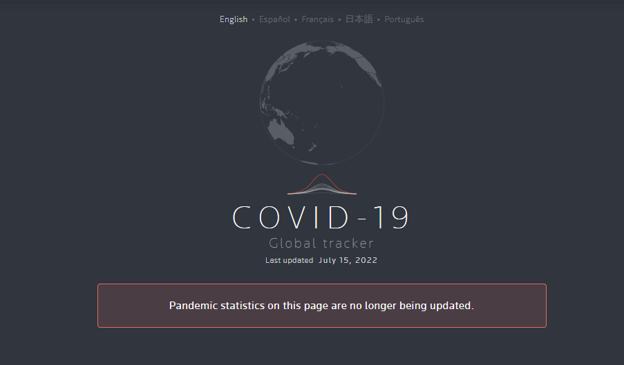
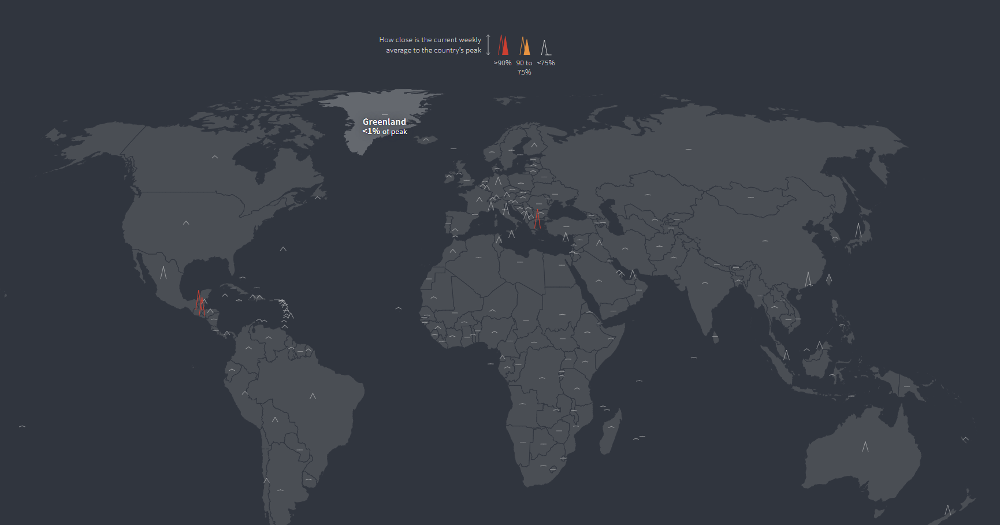
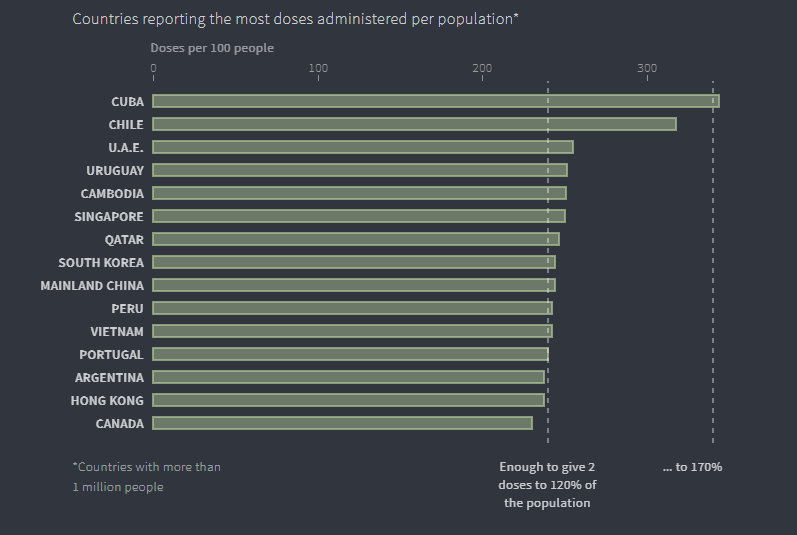
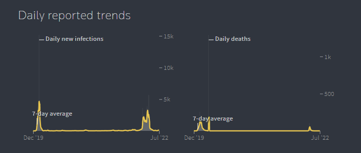
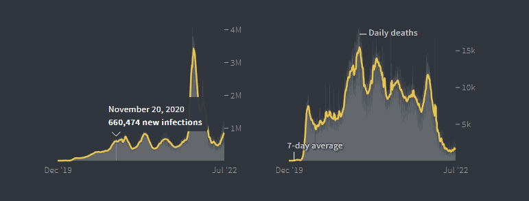
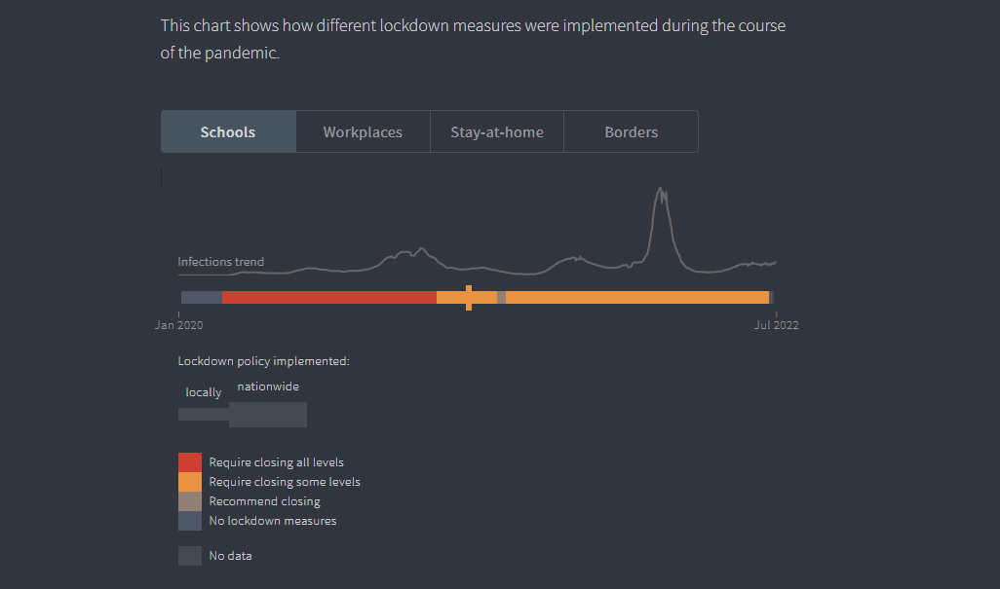
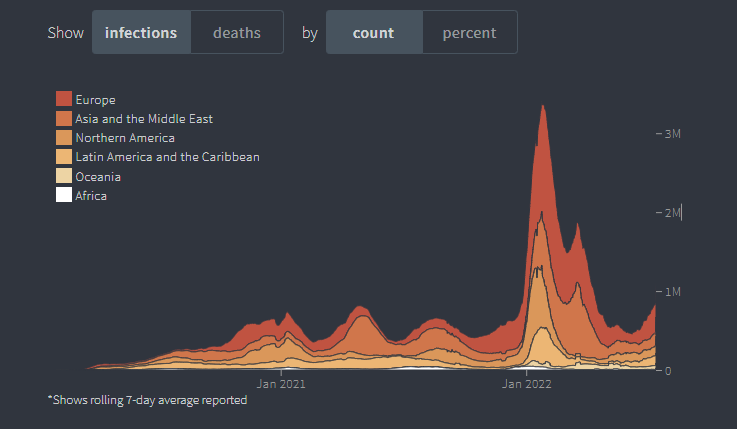
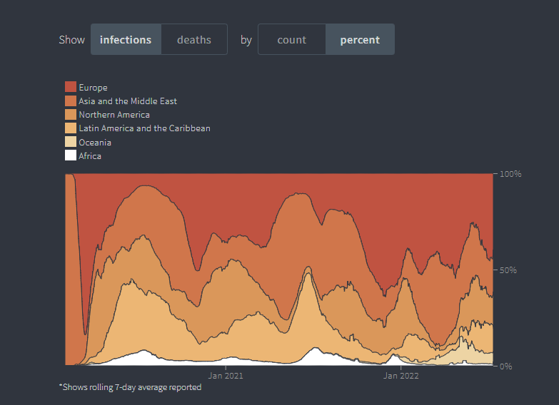

 &nbsp;&nbsp;&nbsp;&nbsp; The COVID-19 Global tracker is a data-driven project developed by Reuters to provide real-time data tracking of the coronavirus outbreak around the world. The project uses visual maps, trend graphs and interactive data analysis tools to show countries' confirmed COVID-19 cases, deaths, vaccination progress, and government response policies such as lockdowns, school closures, and border controls from **December 2019 to July 2022**.
  

    

  
> It is worth mentioning that it was a time-sensitive dataset at the time, but now it has automatically become a project with history.

***

 &nbsp;&nbsp;&nbsp;&nbsp; The project provides people with real-time epidemic data and enhances their understanding of epidemic trends through visualization.
  

    

<em>An interactive world map, one of the data visualizations in this dataset</em>

 &nbsp;&nbsp;&nbsp;&nbsp; As a result, the thesis of the project is implicit, relying mainly on the data itself to allow readers to draw conclusions, rather than directly providing analytical commentary. If the readers have analyze the data themselves, they can use the data to explore the changes of the epidemic and draw their own views by combining different aspects of the data. At that time, the project updated the data in real time, so that people can get the latest situation of the epidemic more intuitively, and can make a quick comparison, which is very valuable.

***
  
 &nbsp;&nbsp;&nbsp;&nbsp; According to the introduction of the project itself, the data of the project mainly comes from:
  
- **WHO**
- **Johns Hopkins University**
- **Governments and public health agencies**

 &nbsp;&nbsp;&nbsp;&nbsp; Covering the global epidemic data, including:
  
- **Data on the number of confirmed cases and deaths (new and cumulative daily data)**
- **Vaccination progress (vaccination rates in different countries)**
- **Government policies (lockdowns, border controls, school closures, etc.)**

&nbsp;&nbsp;&nbsp;&nbsp; The data itself is also obtained and verified from a variety of sources: government speeches, press releases and even official Twitter posts, and presented in a visual graph that allows readers to filter through different countries or time periods to see the trend of the epidemic. Compared with traditional statistical data reporting, this visualization method is more intuitive and easier for readers to compare and analyze, which means that the data is used well.

    

<em>Vaccination data graph</em>

 &nbsp;&nbsp;&nbsp;&nbsp; However, just like the description in the project web page, the data set itself has a great accuracy problem, which has nothing to do with the project, but mainly lies in the data source. For example, in the statistical process of countries, due to the different statistical standards and detection capabilities of countries, countries with high detection rates have more possible cases and deaths, while countries with low detection rates have fewer.
  
&nbsp;&nbsp;&nbsp;&nbsp;  A deeper problem is whether organizations are providing real data, which is a question of data transparency: The chart below shows the number of infections and deaths since the outbreak began in China:

    

<em>Epidemic data in China</em>

> This inference is not only based on personal subjective feelings; government agencies that mask data have also experienced loopholes. After the real data was released, it was urgently deleted. (details visible at [here](https://www.nytimes.com/2023/07/19/world/asia/china-covid-data-toll.html), This report is already from 2023, but you can think of previous data that was masked in the same way).

***

&nbsp;&nbsp;&nbsp;&nbsp;  The data organization and presentation of this project is very simple and clear. Each chart has a clear mark to tell the reader what it is. Also, the chart itself is not complicated, basically consisting of some bar charts or line charts.

    

&nbsp;&nbsp;&nbsp;&nbsp;   The dataset itself also has a separate page for each country, which can be reached directly by clicking under the main page. This simple index function greatly improves the readability of the data, so that readers can find the data they need to know more quickly. 

    

<em>Indexes</em>

 &nbsp;&nbsp;&nbsp;&nbsp;  One other thing that this dataset does very well is that it puts together the epidemic policies and epidemic data of each country for people to compare and analyze. Epidemic policies include school closures, border control measures, etc. One can analyze not only the increase in infections and deaths, but also the difference between countries that are strictly locked down and those that are open, and understand the impact of the policies. This provides a degree of context to the dataset. 

    

<em>A graph combining epidemic policy with the number of infected people</em>

&nbsp;&nbsp;&nbsp;&nbsp;   Due to the huge size of this dataset, the background provided by it is obviously insufficient. Data on different countries, different policies, number of infections, number of deaths, vaccination progress, etc. are stacked together, and the average reader may be confused by the dataset and not properly understand the role of the data set itself. Although the filtering and visualization functions have done a good job, it is difficult for the average reader to make much sense of the data set without more explanation and context.

***
   
&nbsp;&nbsp;&nbsp;&nbsp;   Like the previous analysis, the dataset did what it was supposed to do: count the various data during the outbreak and visualize it for people to see and analyze. However, for overly large data, this dataset is not able to better analyze it (it can do better), for professional people, the data of this dataset is detailed and the chart is highly interactive, which can provide good support for their research or analysis of the epidemic. But for average readers, they may be more inclined to draw conclusions directly, and such content is difficult to find in this data set. So when the dataset was given to different audiences, the effect of the information conveyed may vary greatly, if further reading guide can be provided, this gap may be shortened.

    

<em>Shows the number of infections on different continents</em>

    

<em>Shows the number of infections on different continents as a percentage of all infections</em>

***

&nbsp;&nbsp;&nbsp;&nbsp;   **Overall, the project is a powerful epidemic data and visualization tool that meets the needs of the general public and is also more suitable for use by researchers and professionals.**
